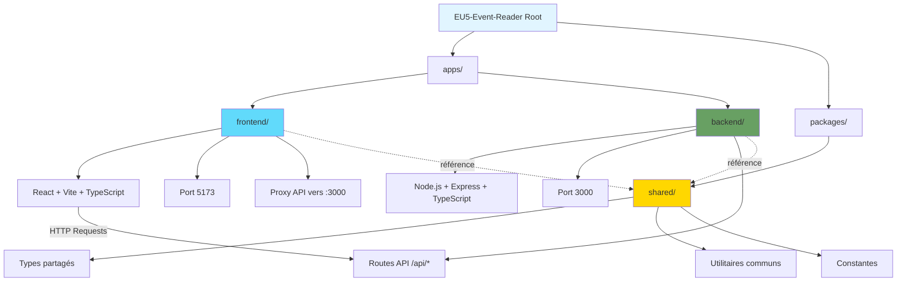

# EU5 Event Reader

Monorepo pnpm pour une application React (frontend) et une API Express (backend) partageant des types/utilitaires communs.

## Structure

```
EU5-Event-Reader/
├── apps/
│   ├── frontend/          # React + Vite
│   └── backend/           # Express + TypeScript
├── packages/
│   └── shared/            # Types et utilitaires communs
├── pnpm-workspace.yaml
├── package.json
├── .gitignore
└── README.md
```

## Installation

```bash
pnpm install
```

## Développement

```bash
pnpm dev            # lance frontend + backend
pnpm dev:frontend   # frontend uniquement
pnpm dev:backend    # backend uniquement
```

## Build et vérifications

```bash
pnpm build          # build récursif
pnpm type-check     # vérif TS (project refs)
pnpm lint           # lint TypeScript/React
```

## Technologies

- React 19 + Vite 7
- Node.js + Express
- TypeScript 5.8
- pnpm workspaces

## Architecture (mermaid)


