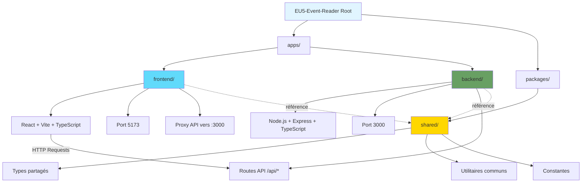

I have created the following plan after thorough exploration and analysis of the codebase. Follow the below plan verbatim. Trust the files and references. Do not re-verify what's written in the plan. Explore only when absolutely necessary. First implement all the proposed file changes and then I'll review all the changes together at the end.

## Observations Clés

Le projet est un nouveau répertoire vide nécessitant une initialisation complète. Pour un monorepo moderne en 2025, **pnpm** est l'outil recommandé pour sa gestion stricte des dépendances et ses performances supérieures. La structure `/apps` et `/packages` est la convention standard pour séparer les applications des bibliothèques partagées. Les versions actuelles sont React 19.x, Vite 7.x, et TypeScript 5.8.x.

## Approche Retenue

Utilisation de **pnpm workspaces** pour gérer le monorepo avec une structure claire : `apps/frontend` (React + Vite), `apps/backend` (Node.js + Express + TypeScript), et `packages/shared` (types et utilitaires communs). Configuration TypeScript avec project references pour optimiser les builds et maintenir des frontières logiques entre les packages. Scripts npm centralisés à la racine pour lancer simultanément frontend et backend en développement.

---

## Structure du Projet

```
EU5-Event-Reader/
├── apps/
│   ├── frontend/          # Application React + Vite
│   └── backend/           # API Node.js + Express + TypeScript
├── packages/
│   └── shared/            # Types et utilitaires partagés
├── pnpm-workspace.yaml    # Configuration workspace pnpm
├── package.json           # Scripts et dépendances racine
├── .gitignore
└── README.md
```

---

## Plan d'Implémentation

### 1. Initialisation du Monorepo avec pnpm

**Créer les fichiers de configuration racine :**

- Initialiser `package.json` à la racine avec `pnpm init`
- Créer `pnpm-workspace.yaml` avec le contenu suivant :
  ```yaml
  packages:
    - 'apps/*'
    - 'packages/*'
  ```
- Configurer `package.json` racine avec :
  - `"private": true` pour éviter la publication accidentelle
  - Scripts pour gérer le monorepo : `dev`, `build`, `lint`, `type-check`
  - Dépendances de développement communes : `typescript`, `@types/node`, `prettier`, `eslint`

**Créer la structure de dossiers :**

- Créer les répertoires : `apps/frontend`, `apps/backend`, `packages/shared`
- Ajouter un `.gitignore` global incluant : `node_modules/`, `dist/`, `.env`, `*.log`, `.pnpm-store/`

---

### 2. Configuration de l'Application Frontend (React + Vite)

**Initialiser le projet React avec Vite :**

- Dans `apps/frontend`, exécuter : `pnpm create vite . --template react-ts`
- Configurer `package.json` du frontend avec le nom : `@eu5-reader/frontend`

**Configuration TypeScript pour le frontend :**

- Créer trois fichiers de configuration TypeScript :
  - `tsconfig.json` (racine, avec project references)
  - `tsconfig.app.json` (configuration pour le code source React)
  - `tsconfig.node.json` (configuration pour Vite config)
- Dans `tsconfig.app.json`, configurer :
  - `target: "ES2020"`
  - `lib: ["ES2020", "DOM", "DOM.Iterable"]`
  - `jsx: "react-jsx"`
  - `strict: true`
  - Path aliases : `"@/*": ["./src/*"]`, `"@shared/*": ["../../packages/shared/src/*"]`
- Créer `vite-env.d.ts` avec `/// <reference types="vite/client" />`

**Configuration Vite :**

- Dans `vite.config.ts`, configurer :
  - Plugin React avec SWC : `@vitejs/plugin-react-swc`
  - Path aliases correspondant au tsconfig
  - Serveur de développement sur le port 5173
  - Proxy API vers le backend : `'/api': 'http://localhost:3000'`

**Dépendances frontend :**

- Installer les dépendances principales : `react@^19`, `react-dom@^19`
- Installer les dépendances de développement : `@vitejs/plugin-react-swc`, `vite@^7`, `typescript@~5.8`
- Ajouter des outils utiles : `react-router-dom` (navigation), `axios` ou `fetch` (API calls)

---

### 3. Configuration du Backend (Node.js + Express + TypeScript)

**Initialiser le projet backend :**

- Dans `apps/backend`, créer `package.json` avec `pnpm init`
- Configurer le nom : `@eu5-reader/backend`
- Définir `"type": "module"` pour utiliser les ES modules

**Configuration TypeScript pour le backend :**

- Créer `tsconfig.json` avec :
  - `target: "ES2022"`
  - `module: "ESNext"`
  - `moduleResolution: "bundler"`
  - `outDir: "./dist"`
  - `rootDir: "./src"`
  - `strict: true`
  - Path aliases : `"@shared/*": ["../../packages/shared/src/*"]`
  - `esModuleInterop: true`, `skipLibCheck: true`

**Structure de dossiers backend :**

- Créer `src/` avec :
  - `index.ts` (point d'entrée)
  - `routes/` (endpoints API)
  - `services/` (logique métier)
  - `utils/` (utilitaires)
  - `types/` (types TypeScript locaux)

**Dépendances backend :**

- Installer les dépendances principales : `express@^4`, `cors`, `dotenv`
- Installer les types : `@types/express`, `@types/cors`, `@types/node`
- Installer les outils de développement : `tsx` (exécution TypeScript), `nodemon` (hot reload)

**Scripts backend :**

- `dev`: `nodemon --exec tsx src/index.ts` (développement avec hot reload)
- `build`: `tsc` (compilation TypeScript)
- `start`: `node dist/index.js` (production)

**Fichier d'entrée `src/index.ts` :**

- Initialiser Express avec middleware de base : `express.json()`, `cors()`
- Configurer le port (par défaut 3000, configurable via `.env`)
- Créer une route de test : `GET /api/health`
- Ajouter gestion d'erreurs globale

---

### 4. Configuration du Package Partagé

**Initialiser le package shared :**

- Dans `packages/shared`, créer `package.json` avec `pnpm init`
- Configurer le nom : `@eu5-reader/shared`
- Définir les exports : `"exports": { ".": "./src/index.ts" }`

**Configuration TypeScript :**

- Créer `tsconfig.json` avec :
  - `target: "ES2022"`
  - `module: "ESNext"`
  - `declaration: true` (générer les fichiers `.d.ts`)
  - `declarationMap: true`
  - `composite: true` (pour project references)
  - `outDir: "./dist"`

**Structure du package shared :**

- Créer `src/` avec :
  - `index.ts` (point d'entrée exportant tout)
  - `types/` (types partagés : événements, pays, traductions, etc.)
  - `utils/` (fonctions utilitaires communes)
  - `constants/` (constantes partagées)

**Types de base à créer :**

- `Event` : structure d'un événement EU5
- `Country` : informations sur un pays
- `Localization` : structure des traductions
- `EventTrigger`, `EventOption`, `EventEffect` : sous-structures d'événements

---

### 5. Configuration des Project References TypeScript

**Configurer les références entre projets :**

- Dans `apps/frontend/tsconfig.json`, ajouter :
  ```json
  "references": [
    { "path": "../../packages/shared" }
  ]
  ```
- Dans `apps/backend/tsconfig.json`, ajouter la même référence
- Cela permet à TypeScript de comprendre les dépendances entre packages

**Créer un `tsconfig.json` racine :**

- À la racine du monorepo, créer un fichier qui référence tous les projets :
  ```json
  {
    "files": [],
    "references": [
      { "path": "./apps/frontend" },
      { "path": "./apps/backend" },
      { "path": "./packages/shared" }
    ]
  }
  ```

---

### 6. Scripts NPM Centralisés

**Configurer les scripts dans le `package.json` racine :**

- `"dev"`: Lancer frontend et backend simultanément avec `concurrently`
  - `concurrently "pnpm --filter @eu5-reader/frontend dev" "pnpm --filter @eu5-reader/backend dev"`
- `"dev:frontend"`: `pnpm --filter @eu5-reader/frontend dev`
- `"dev:backend"`: `pnpm --filter @eu5-reader/backend dev`
- `"build"`: `pnpm -r build` (build récursif de tous les packages)
- `"type-check"`: `tsc --build` (vérification TypeScript avec project references)
- `"lint"`: `eslint . --ext .ts,.tsx` (si ESLint est configuré)
- `"clean"`: `pnpm -r exec rm -rf dist node_modules` (nettoyage)

**Installer `concurrently` :**

- À la racine : `pnpm add -D concurrently`
- Permet d'exécuter plusieurs commandes en parallèle avec une sortie colorée

---

### 7. Configuration des Outils de Qualité de Code

**ESLint (optionnel mais recommandé) :**

- Installer à la racine : `pnpm add -D eslint @typescript-eslint/parser @typescript-eslint/eslint-plugin`
- Créer `.eslintrc.json` avec configuration de base TypeScript
- Ajouter des règles spécifiques React pour le frontend

**Prettier (formatage de code) :**

- Installer à la racine : `pnpm add -D prettier`
- Créer `.prettierrc` avec configuration : `{ "semi": true, "singleQuote": true, "tabWidth": 2 }`
- Ajouter `.prettierignore` : `dist/`, `node_modules/`, `*.log`

**EditorConfig :**

- Créer `.editorconfig` pour la cohérence entre éditeurs :
  ```
  root = true
  [*]
  charset = utf-8
  indent_style = space
  indent_size = 2
  end_of_line = lf
  insert_final_newline = true
  ```

---

### 8. Variables d'Environnement

**Backend `.env` :**

- Créer `apps/backend/.env.example` avec :
  ```
  PORT=3000
  NODE_ENV=development
  ```
- Ajouter `.env` au `.gitignore`
- Utiliser `dotenv` pour charger les variables dans `src/index.ts`

**Frontend `.env` :**

- Créer `apps/frontend/.env.example` avec :
  ```
  VITE_API_URL=http://localhost:3000/api
  ```
- Les variables Vite doivent commencer par `VITE_`

---

### 9. Documentation Initiale

**Créer un `README.md` à la racine :**

- Description du projet EU5 Event Reader
- Structure du monorepo
- Instructions d'installation : `pnpm install`
- Instructions de développement : `pnpm dev`
- Instructions de build : `pnpm build`
- Technologies utilisées : React 19, Vite 7, Node.js, TypeScript 5.8, Express, pnpm

**README par package :**

- `apps/frontend/README.md` : spécificités du frontend
- `apps/backend/README.md` : spécificités du backend, routes API
- `packages/shared/README.md` : documentation des types et utilitaires partagés

---

## Diagramme d'Architecture



---

## Tableau des Dépendances Principales

| Package | Frontend | Backend | Shared | Version |
|---------|----------|---------|--------|---------|
| **React** | ✅ | ❌ | ❌ | ^19.1 |
| **Vite** | ✅ | ❌ | ❌ | ^7.1 |
| **TypeScript** | ✅ | ✅ | ✅ | ~5.8 |
| **Express** | ❌ | ✅ | ❌ | ^4.21 |
| **tsx** | ❌ | ✅ | ❌ | latest |
| **react-router-dom** | ✅ | ❌ | ❌ | ^7.8 |
| **cors** | ❌ | ✅ | ❌ | latest |
| **dotenv** | ❌ | ✅ | ❌ | latest |

---

## Commandes d'Installation Complètes

**À la racine du projet :**

```bash
# 1. Initialiser pnpm workspace
pnpm init

# 2. Installer les dépendances de développement racine
pnpm add -D typescript @types/node prettier eslint concurrently

# 3. Créer la structure
mkdir -p apps/frontend apps/backend packages/shared

# 4. Initialiser le frontend
cd apps/frontend
pnpm create vite . --template react-ts
pnpm install

# 5. Initialiser le backend
cd ../backend
pnpm init
pnpm add express cors dotenv
pnpm add -D @types/express @types/cors @types/node tsx nodemon typescript

# 6. Initialiser le package shared
cd ../../packages/shared
pnpm init
pnpm add -D typescript

# 7. Retour à la racine et installation globale
cd ../..
pnpm install
```

---

## Vérification Post-Installation

**Tester que tout fonctionne :**

1. Vérifier la compilation TypeScript : `pnpm type-check`
2. Lancer le mode développement : `pnpm dev`
3. Vérifier que le frontend est accessible sur `http://localhost:5173`
4. Vérifier que le backend répond sur `http://localhost:3000/api/health`
5. Tester le hot reload en modifiant un fichier frontend et backend

---

## Fichiers de Configuration Clés

### `pnpm-workspace.yaml`
```yaml
packages:
  - 'apps/*'
  - 'packages/*'
```

### `package.json` racine (extrait)
```json
{
  "name": "eu5-event-reader",
  "private": true,
  "scripts": {
    "dev": "concurrently \"pnpm --filter @eu5-reader/frontend dev\" \"pnpm --filter @eu5-reader/backend dev\"",
    "build": "pnpm -r build",
    "type-check": "tsc --build"
  }
}
```

### `apps/frontend/vite.config.ts`
```typescript
import { defineConfig } from 'vite'
import react from '@vitejs/plugin-react-swc'
import path from 'path'

export default defineConfig({
  plugins: [react()],
  resolve: {
    alias: {
      '@': path.resolve(__dirname, './src'),
      '@shared': path.resolve(__dirname, '../../packages/shared/src')
    }
  },
  server: {
    port: 5173,
    proxy: {
      '/api': 'http://localhost:3000'
    }
  }
})
```

### `apps/backend/src/index.ts` (structure de base)
```typescript
import express from 'express'
import cors from 'cors'
import dotenv from 'dotenv'

dotenv.config()

const app = express()
const PORT = process.env.PORT || 3000

app.use(cors())
app.use(express.json())

app.get('/api/health', (req, res) => {
  res.json({ status: 'ok', message: 'Backend is running' })
})

app.listen(PORT, () => {
  console.log(`Backend running on http://localhost:${PORT}`)
})
```

---

## Points d'Attention

- **pnpm** doit être installé globalement : `npm install -g pnpm`
- Les path aliases TypeScript doivent être synchronisés entre `tsconfig.json` et `vite.config.ts`
- Le package `@eu5-reader/shared` doit être référencé dans les `package.json` du frontend et backend
- Les variables d'environnement Vite doivent commencer par `VITE_`
- Utiliser `tsx` pour exécuter le backend en développement (support TypeScript natif)